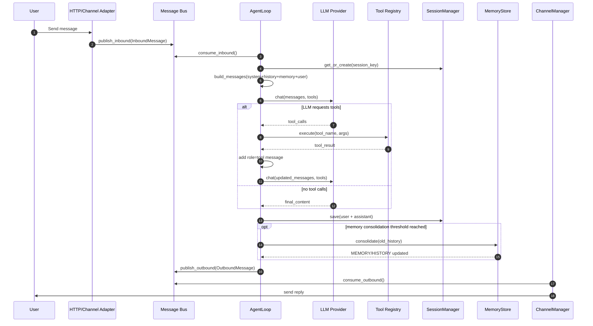

# nanobot 对外 API 到最终功能实现链路

本文档给出一条完整实现链路：

**外部请求 -> Channel/API 适配层 -> Bus -> Agent Loop -> Tool 执行 -> Session/Memory 持久化 -> Outbound 返回**

## 1. 架构分层

1) Ingress（入口层）
- HTTP API（如 `/v1/chat`）或聊天平台 Webhook/SDK
- 职责：鉴权、参数校验、标准化消息

2) Bus（消息总线）
- 入口层将消息写入 inbound queue
- AgentLoop 从 inbound queue 消费
- AgentLoop 写 outbound queue

3) Agent Loop（核心执行）
- 构建上下文（system + history + memory + 当前输入）
- 调用 LLM
- 若返回 tool calls：执行工具并回填 tool result 再次调用 LLM
- 直到得到 final answer 或达到迭代上限

4) Tools（能力层）
- 文件、shell、web、cron、message 等
- 参数校验、超时控制、结构化结果

5) State（状态层）
- Session：短期/中期上下文（JSONL）
- Memory：长期记忆（MEMORY.md + HISTORY.md）

6) Egress（回传层）
- OutboundMessage 路由到对应 channel
- 对 HTTP 接口可同步返回或走流式输出

---

## 2. 时序图（Mermaid）

---

## 3. 关键实现要点

- `max_iterations` 防止 tool loop 死循环
- 工具返回统一 JSON 字符串，便于模型消费
- Session append-only，便于审计与重放
- Memory consolidation 与主链路解耦，避免阻塞主响应
- 入口层不做推理，所有智能行为集中在 AgentLoop

---

## 4. 文件映射（nanobot）

- Agent loop: `nanobot/agent/loop.py`
- Context: `nanobot/agent/context.py`
- Memory: `nanobot/agent/memory.py`
- Session: `nanobot/session/manager.py`
- Bus: `nanobot/bus/events.py`, `nanobot/bus/queue.py`
- Channels: `nanobot/channels/base.py`, `nanobot/channels/manager.py`
- Providers: `nanobot/providers/base.py`

